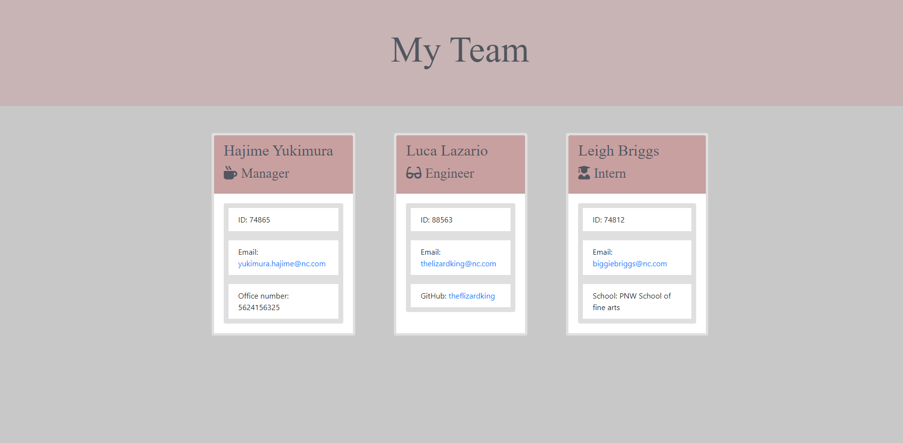

# Challenge Ten
Object Oriented Programming: Team Profile Generator

## Project Description

A Command Line application to generate a webpage that displays a Manager's team information. This will allow them quick access to emails and GitHub profiles. The Command Line Application accepts user input and prompts the user for important information. This information, once filled out correctly, is fed into the generateHTML.js file which then creates the index.html file and becomes available on a webpage. 

## Details and Walkthrough

<b>Webpage</b>

 

 
 

https://drive.google.com/file/d/1rOX25AYLrMVo2ohehsG_RjJeL1yDt0wJ/view?usp=sharing

 

[Video link](https://drive.google.com/file/d/1rOX25AYLrMVo2ohehsG_RjJeL1yDt0wJ/view?usp=sharing)

 

## Github Username and Link

[Kiriludp](https://github.com/kiriludp)

[Challenge-Ten Repo](https://github.com/kiriludp/Challenge-Ten_Profiles)

 

## Credits

Thanks to the UW Coding Bootcamp Tutors, TAs, and instructor for helping me learn so much in such a short time. 

 
 

*made to slay : キリキリ* 

